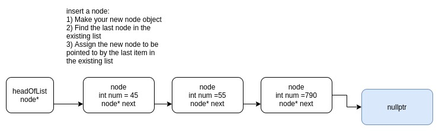
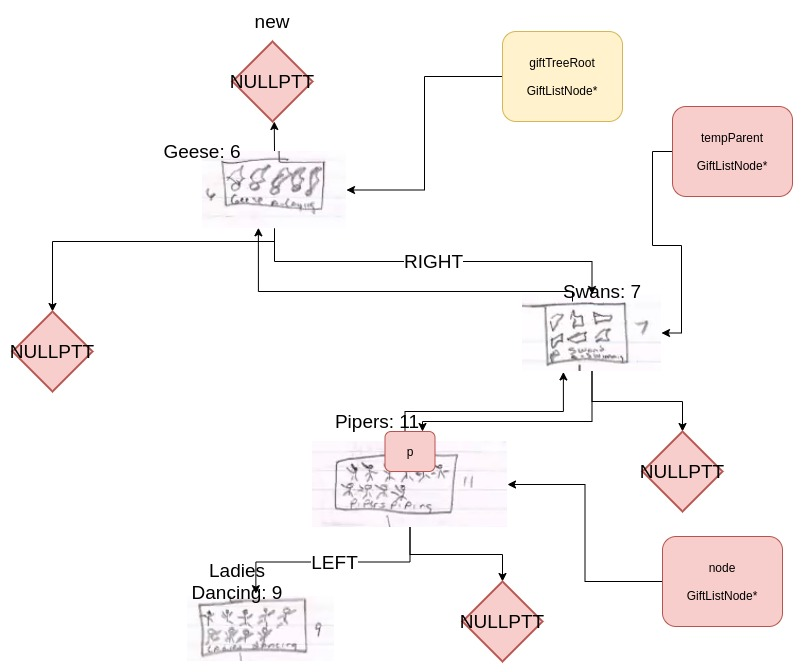

# Sample data structures project diagram
Students in CIT-245 undertook a data structures project. To aid in the design, students created diagrams or figures to depict what their C++ code does "under the hood".

## Custom linked list class
### Overview
Linked list nodes contain:
* num number
* node&#x002A; next

### Planning Diagram

### Special thanks
Thanks to student Ka'Ce for working with us on this diagram

## Binary search tree
### Overview
Binary search trees are handy for looking up values in large data sets

### Planning diagram
